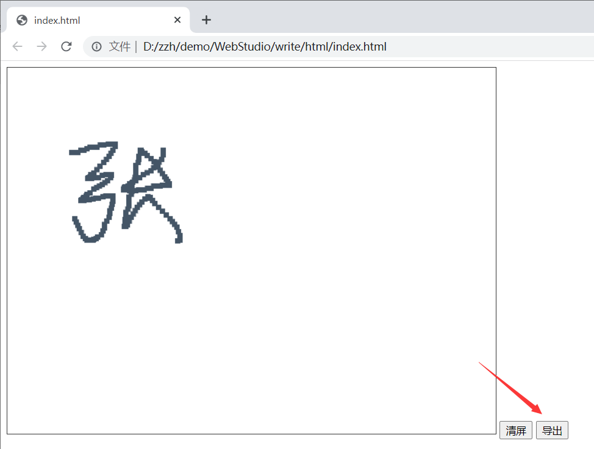
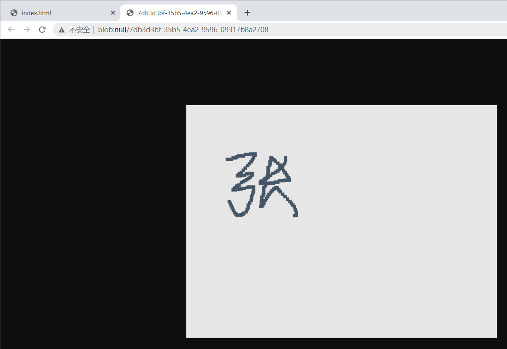
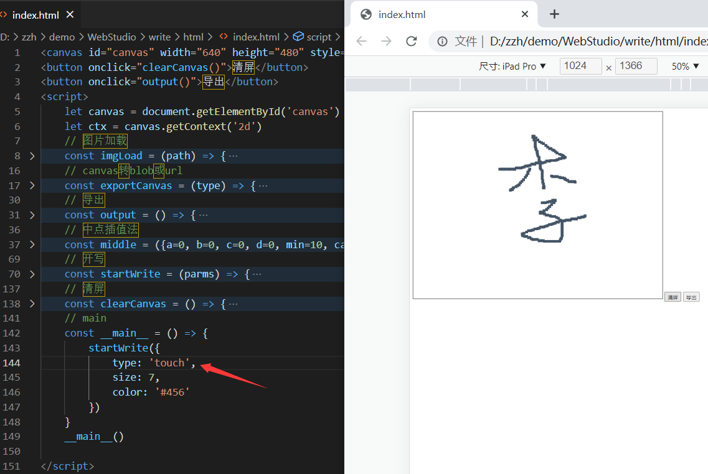
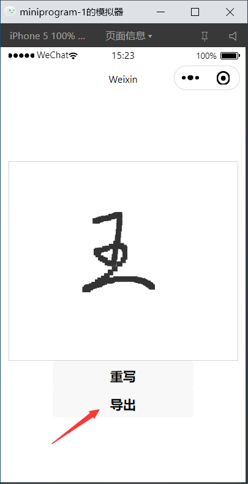
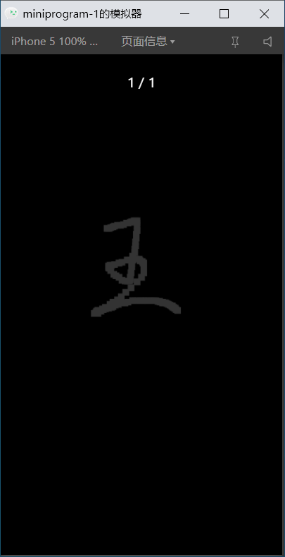
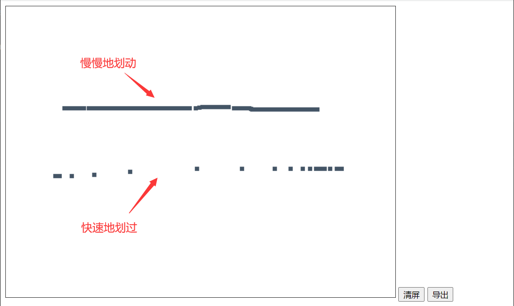
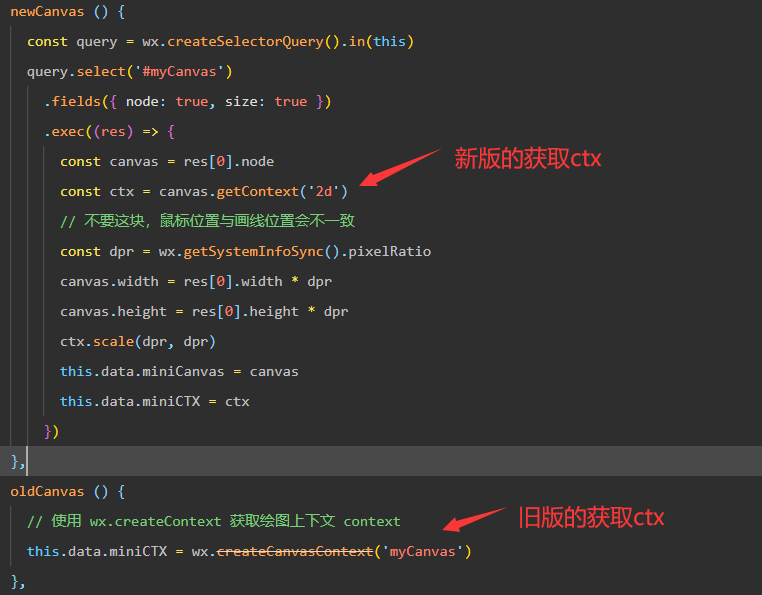
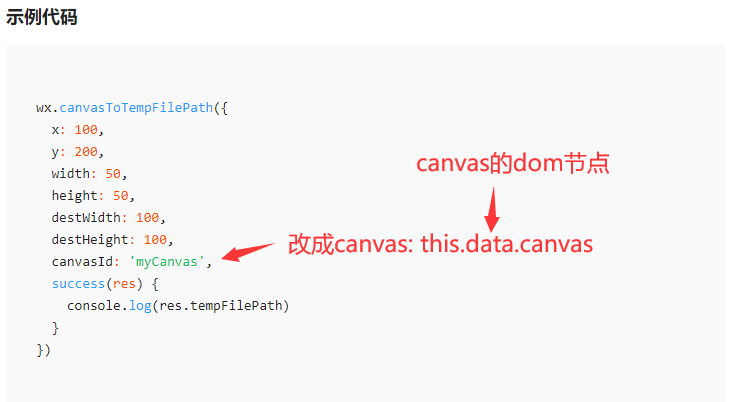
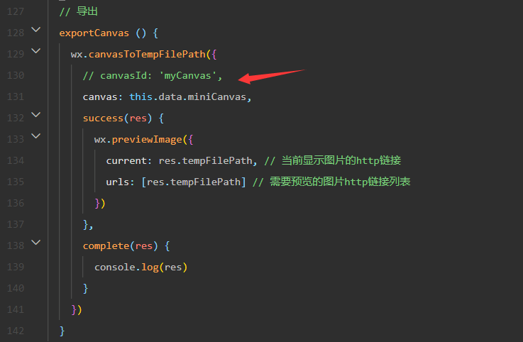

### Write

#### Project Introduction

基于canvas的一个手写系统，支持鼠标事件和触摸事件

有HTML和微信小程序两种版本

#### Project Preview

HTML版本

微信小程序版

#### Problems Encountered

Q1: move事件的触发频率是有上限的，即会出现这种情况

move的越快，点就越疏散

A1: 使用中点插值法，根据相邻两点，推出该路径上中间的其他点，具体思路如下

计算点A(x1, y1)和B(x2,y2)的距离是否大于一个给定的数值，若大于则插入AB间的n等分点

Q2: 微信小程序的canvas必须要调用draw函数，才会有图像（draw会自动清屏，可讨厌了）

A2：用新版的canvas就行了（V2.9.0以上），新旧二者获取ctx(上下文)的方法不一样

Q3: 微信小程序想要把canvas转成一个url，需要调用canvasToTempFilePath函数，而调用它之前又需要先调用draw函数，

不幸的是，新版canvas没有draw函数

A3: 其实canvasToTempFilePath函数不需要先调用draw函数，只要你不用canvas-id，改用canvas的dom节点

（造成这个错觉，是因为官网的示例代码，太旧了）

